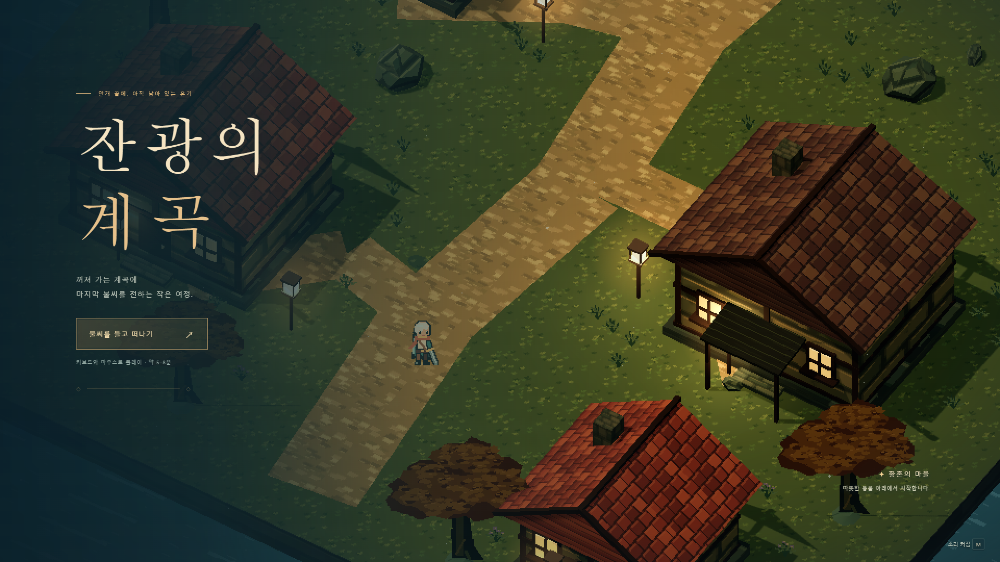
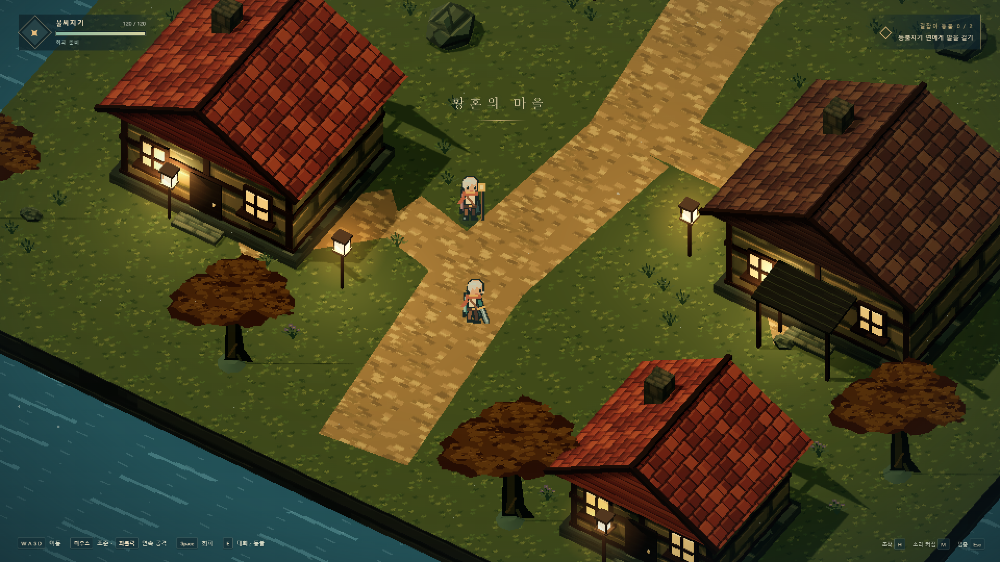
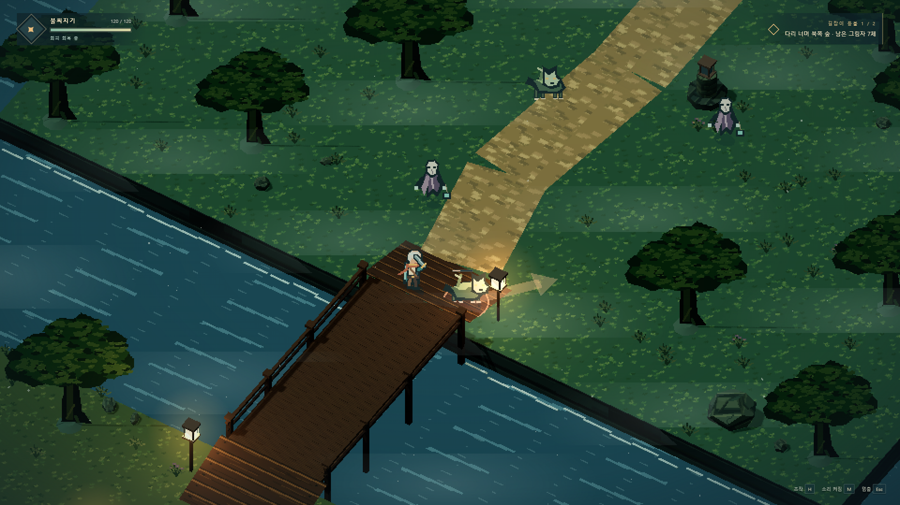
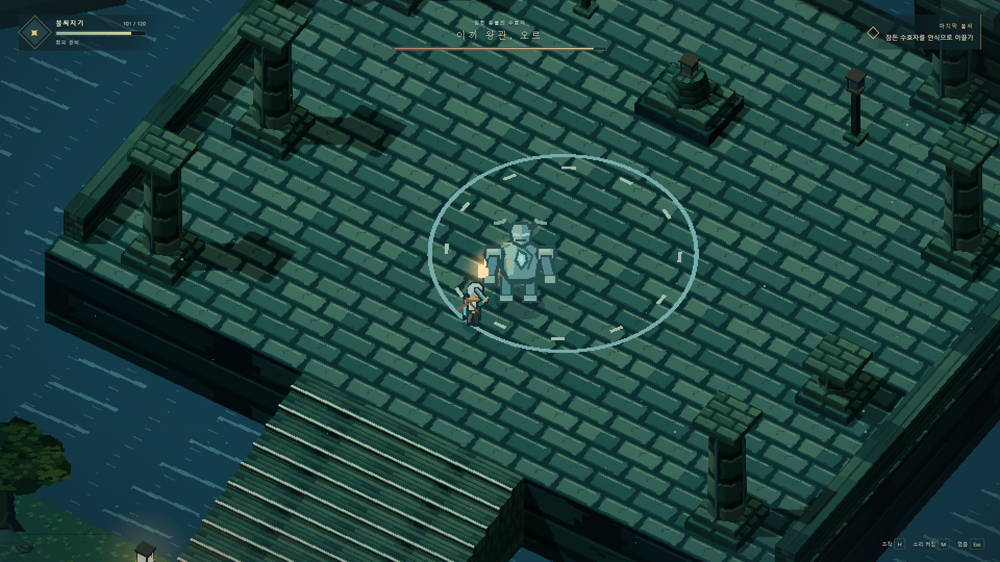
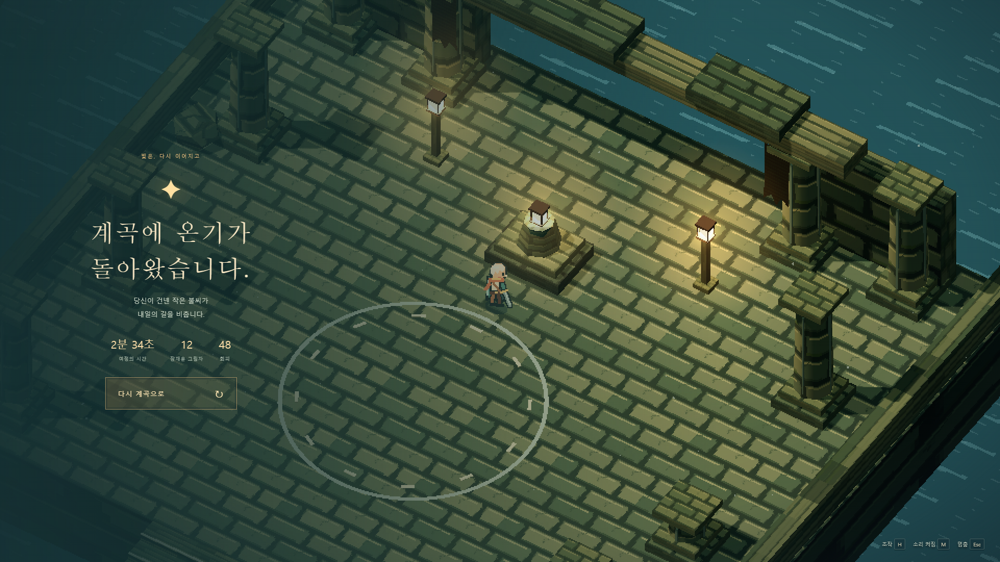
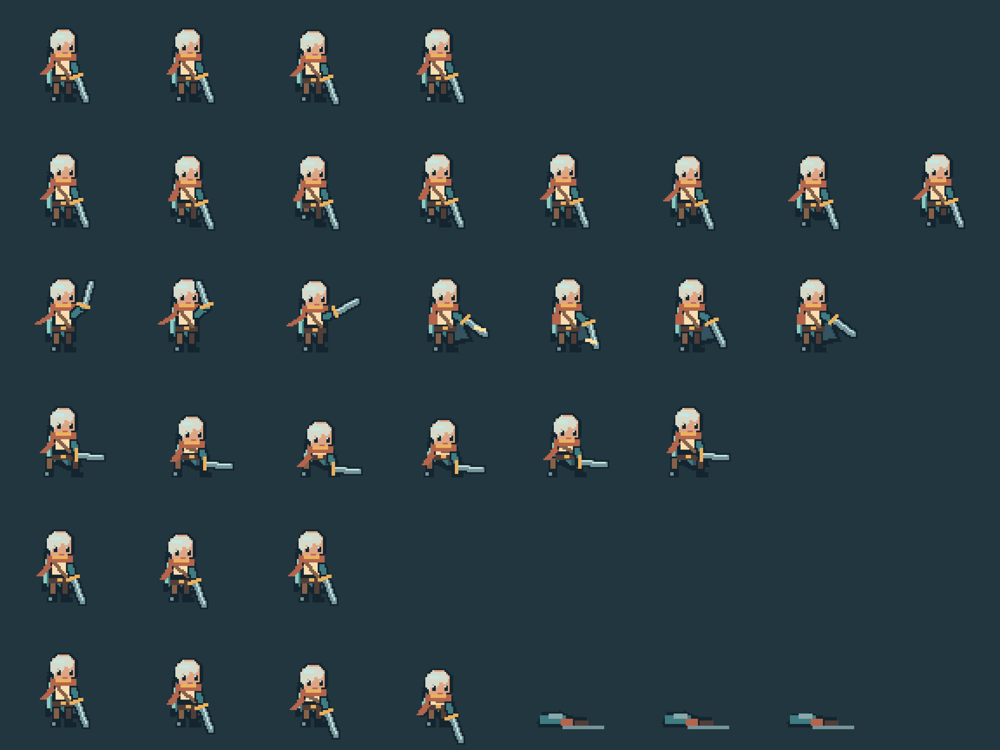
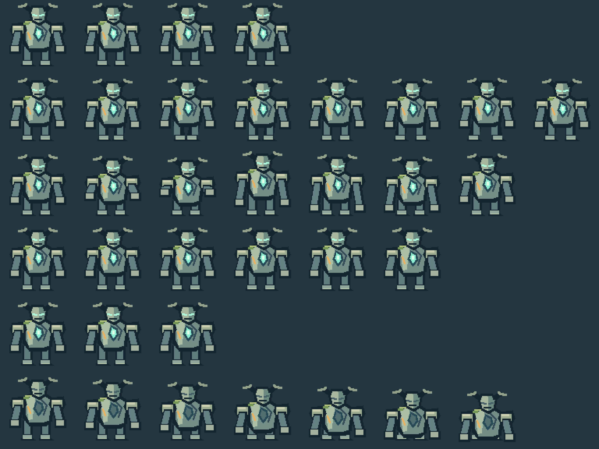

# Lastlight Valley — 잔광의 계곡

> 따뜻한 마을의 마지막 불씨를 들고 물안개 낀 숲과 다리를 지나, 폐허의 신전에 빛을 되돌리는 짧은 2.5D 픽셀 액션 RPG.

[](https://www.typescriptlang.org/)
[](https://threejs.org/)
[](https://vite.dev/)
[](https://legerdo.github.io/lastlight-valley/)

**[▶ 브라우저에서 바로 플레이](https://legerdo.github.io/lastlight-valley/)**

[](https://legerdo.github.io/lastlight-valley/)

## About

**잔광의 계곡**은 TypeScript + Three.js + Vite로 만든 데스크톱 브라우저용 2.5D 픽셀 액션 RPG입니다.

황혼의 마을에서 출발해 두 개의 길잡이 등불을 되살리고, 물안개 낀 숲과 입체적인 다리를 건너 폐허의 신전에 도달합니다. 마지막에는 두 종류 이상의 공격 패턴을 가진 수호자 **오르**를 쓰러뜨리고 신전의 불빛을 복원해야 합니다.

주인공·NPC·적·보스·지형·건축·식생·효과는 외부 완성형 에셋팩 없이 프로젝트 코드에서 직접 생성합니다. 픽셀 캐릭터는 실제 방향별 프레임 애니메이션을 사용하며, 월드는 Three.js의 깊이·조명·그림자·높이 정보를 활용합니다.

### Highlights

- **수제 2.5D 월드** — 황혼의 마을 → 남쪽 숲 → 다리 → 북쪽 숲 → 폐허 신전
- **코드 생성 픽셀 아트** — 4방향 이동과 공격·회피·피격·사망 프레임
- **입체 공간** — 실제 높이를 가진 다리, 계단, 경사, 건물, 기둥과 깊이 기반 가림
- **액션 피드백** — 공격 준비/타격/회수, hit-stop, 스파크, 반동, 카메라 충격
- **서로 다른 적 행동** — 돌진하는 이끼 늑대, 투사체를 사용하는 가면 망령
- **보스전** — 예고 동작과 복수 패턴, 전용 HUD와 환경 연출
- **환경 표현** — 흐르는 물, 안개, 바람에 흔들리는 식생, 지역별 조명
- **한국어 UI** — 타이틀, HUD, 대화, 목표, 사망/승리 화면
- **Web Audio** — 별도 음원 파일 없이 환경음과 전투 효과음 합성

## Original one-shot prompt

이 게임을 처음부터 구현·검증하도록 지시한 원본 벤치마크 프롬프트도 저장소에 함께 보존했습니다.

**[📄 제작에 사용한 전체 원샷 프롬프트 보기](docs/ONE_SHOT_PROMPT.md)**

프롬프트에는 게임의 범위뿐 아니라 픽셀 아트·프레임 애니메이션·2.5D 공간·조명·게임 필, 정상 입력 완주, 스크린샷/모션 증거, 30초 전투 성능 측정까지 완료 조건으로 포함되어 있습니다.

## Screenshots

### 황혼의 마을



### 물안개 낀 숲



### 수호자 오르



### 신전의 빛



<details>
<summary><strong>픽셀 애니메이션 시트 보기</strong></summary>

#### 주인공



#### 수호자



</details>

## Controls

| 입력 | 동작 |
| --- | --- |
| **WASD** | 이동 |
| **마우스** | 조준 |
| **좌클릭** | 연속 공격 |
| **Space** | 회피 |
| **E** | 대화 / 등불 점화 / 상호작용 |
| **Esc** | 일시정지 / 계속 |
| **M** | 음소거 |
| **H** | 조작 안내 표시 |
| **P** | 안개·입자·광륜·카메라 충격 등 보조 효과 |
| **Enter** | 시작 / 사망·승리 후 재시작 |

시작 카메라 연출은 **Space** 또는 **E**로 건너뛸 수 있습니다.

## Run locally

### Requirements

- Windows 11을 기준으로 제작 및 검증
- Node.js **22.12+**
- npm
- WebGL2를 지원하는 최신 데스크톱 브라우저

### Development

```powershell
git clone https://github.com/Legerdo/lastlight-valley.git
cd lastlight-valley
npm ci
npm run dev
```

브라우저에서 `http://127.0.0.1:5173/`을 엽니다.

### Production build

```powershell
npm run build
npm run preview
```

프로덕션 미리보기는 `http://127.0.0.1:4173/`에서 실행됩니다.

## Gameplay flow

```text
황혼의 마을
   │
   ├─ 등불지기 연과 대화
   │
남쪽 숲 ─ 적 전투 ─ 첫 번째 등불
   │
   ▼
물안개 다리
   │
   ▼
북쪽 숲 ─ 적 전투 ─ 두 번째 등불
   │
   ▼
폐허의 신전
   │
수호자 오르
   │
   ▼
신전의 불씨 복원 → 승리
```

## Technical design

게임 규칙과 렌더링을 분리하고 Three.js 장면은 시뮬레이션 상태를 표현하는 어댑터로 사용합니다.

| 파일 | 책임 |
| --- | --- |
| `src/art.ts` | 제한 팔레트, 픽셀 래스터라이저, 방향별 캐릭터 프레임, 환경 텍스처 생성 |
| `src/world.ts` | 수제 월드 배치, 지면 높이, 계단·경사·다리, 충돌 데이터 |
| `src/simulation.ts` | 이동, 전투, AI, 피해, 회피, 진행, 승리/사망 |
| `src/render.ts` | Three.js 장면, 픽셀 빌보드, 건축, 조명, 그림자, 카메라, 전투 효과 |
| `src/ui.ts` | 타이틀, HUD, 대화, 일시정지, 결과 화면 |
| `src/audio.ts` | Web Audio 기반 환경음과 효과음 |
| `src/main.ts` | 입력, 고정 timestep, 렌더/UI 연결, 진단 API |

### Pixel rendering

- 일반 캐릭터 논리 좌표계: **64×64**
- 실제 출력 캔버스: **72×72**
- 주인공/일반 캐릭터 발 기준점: **(36, 59)**
- 수호자 캔버스: **96×96**, 발 기준점 **(48, 85)**
- 기준 픽셀 밀도: **28 source pixels / world unit**
- 스프라이트 확대/축소: **Nearest**
- 1920×1080 DPR 1 기준 내부 렌더링: **960×540 → 정수 2× 확대**

캐릭터마다 4방향 기준으로 대기·이동·공격·회피·피격·사망 동작을 생성합니다. 아트 재생성 시드는 `ART_SEED = 0x1a571197`, 월드 배치 시드는 `20260929`입니다.

## Verification

최종 릴리스는 실제 Chrome에서 정상 키보드/마우스 입력으로 시작부터 승리까지 자동 완주하고, 별도로 사망 → 재시작 경로를 확인했습니다.

| 검사 | 결과 |
| --- | --- |
| TypeScript typecheck | ✅ 통과 |
| Vite production build | ✅ 통과 |
| 시뮬레이션 회귀 테스트 | ✅ **8 / 8** |
| 시작 → 승리 정상 입력 완주 | ✅ 통과 |
| 사망 → 재시작 | ✅ 통과 |
| 승리 → 재시작 | ✅ 통과 |
| 런타임 오류 | ✅ 관측 0건 |
| 캐릭터 프레임 검사 | ✅ 700프레임, 빈 프레임/경계 잘림 0건 |

검증 자료의 세부 내용은 [`evidence/REVIEW.md`](evidence/REVIEW.md)와 [`evidence/SUMMARY.json`](evidence/SUMMARY.json)에 기록되어 있습니다.

### Performance

보스전 30초 측정 결과:

| 환경 | 결과 |
| --- | --- |
| 브라우저 | Chrome 153 |
| Viewport | 1920×1080, DPR 1 |
| Internal render | 960×540 |
| GPU | NVIDIA GeForce RTX 5080 / D3D11 hardware acceleration |
| 평균 FPS | **119.8 FPS** |
| p95 frame time | **8.40 ms** |
| Draw calls | 약 **293** |
| Triangles | 약 **4.7K** |

> 이 수치는 960×540 내부 렌더링을 정수 2배 확대하는 픽셀 렌더링 경로의 결과이며, 1920×1080 네이티브 내부 렌더링 벤치마크가 아닙니다.

## Useful commands

```powershell
npm test                 # 시뮬레이션 회귀 테스트
npm run typecheck        # TypeScript 검사
npm run build            # 프로덕션 빌드
npm run assets           # 코드 기반 스프라이트 시트 재생성
npm run verify:motion    # 이동/공격/회피/가림 연속 프레임 검사
npm run verify:browser   # 실제 브라우저 정상 입력 완주 검사
npm run verify:performance
npm run verify:release
```

## Known limitations

- 설계 목표는 초회 플레이 **5~8분**이지만, 목표와 좌표를 아는 자동 입력의 최단 완주는 약 2분 35초였습니다. 초회 사람 플레이 시간은 아직 별도로 측정하지 않았습니다.
- 신전 바닥 반복 패턴, 작은 환경 소품 밀도, 보스의 세부 피격/사망 연출은 추가 개선 여지가 있습니다.
- 실제 사람의 청음·주관적 타격감, 저사양 GPU, 소프트웨어 렌더링, 다른 브라우저, 비정수 DPR, 장시간 플레이는 별도 검증하지 않았습니다.
- 데스크톱 키보드/마우스 대상이며 터치 조작은 제공하지 않습니다.

## Asset policy

게임의 시각 에셋은 프로젝트 코드의 픽셀 데이터·지오메트리·셰이더로 생성했습니다. 외부 이미지/영상 생성 모델, 완성형 게임 에셋팩, 기존 게임의 고유 에셋을 사용하지 않습니다.

한글은 사용자의 OS에 설치된 시스템 글꼴을 사용하며 글꼴 파일은 저장소에 포함하지 않습니다.

---

**Live demo:** https://legerdo.github.io/lastlight-valley/
